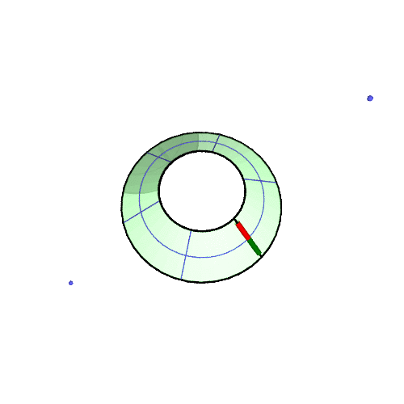

# Understanding the Foucault Pendulum with a Sheet of Paper 

Understanding the rotation of the Foucault Pendulum is not difficult.
You only need a sheet of paper!

### Cut out the figure along the bold lines

### Then, build it up!

For example, overlay the 0-degree edge on top of the 50-degree line, and fix the sheet with a clip.

### Completed !

Rotate the paper model and look at the arrow that comes in front of you.

Or rotate yourself around the model!

### Animation

Rotation at 50 degrees north latitude

### Why?

Obviously the pendulum does not rotate at the North Pole.
It's only the ground that rotates.

The pendulum simply translates in parallel.

In the mid-latitudes, the ground is inclined with respect to the earth's axis.
The pendulum moves on a conical surface consequently.

Surely the pendulum will move in parallel on this conical surface!
However, a conical surface is developable. It can be flattened into a plane.
So,

|draw parallel lines on a plane sheet|Bend the sheet into a conical surface,then you can get the rotation of the Foucault pendulum! |
|||

