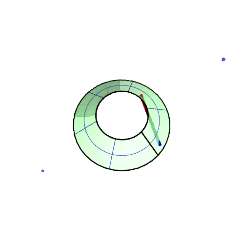

# Use a Piece of Paper, to Understand the Foucault Pendulum 

Understanding the rotation of the Foucault Pendulum is not difficult.
A piece of paper is enough for you! 

* [original in Japanese](http://qiita.com/kuh96/items/a4b0816875fee3684dc4)

### Cut out the figure along the bold lines

### Then, build it up into a cone!

* Each radial line and label (xx degrees) designates the latitude where you want to observe the rotaion of the pendulum.
* For example, overlay the 0-degree edge on top of the 50-degree line, and fix the sheet with a clip.

### Completed !

- Rotate the paper model and look at the arrow that comes in front of you
- Or rotate yourself around the model!

### Animation - Rotation at 50 degrees north latitude

### Why?

- Obviously the pendulum does not rotate near the North Pole
 - It's only the ground that rotates
 - The pendulum simply translates in parallel

- In the mid-latitudes, the ground is inclined with respect to the earth's axis
- The pendulum moves along a conical surface consequently

- Surely the pendulum will move in parallel on this conical surface!
- Luckily a conical surface is developable. It can be flattened into a plane!

So:

|| Draw parallel lines on a plane sheet | Bend the sheet into a conical surface, then you get the rotation of the Foucault pendulum! |
|:-----:|:-----:|:-----:|
|5o degrees|  |  |
|30 degrees|  |  |

# Fixed bugs (2015-05-14)

|fixed|old bug|
|:-----:|:-----:|
|||

# Acknowledgment

This is my first development using **[SageMath](http://www.sagemath.org)** and Python.
Thanks to the great tools !

